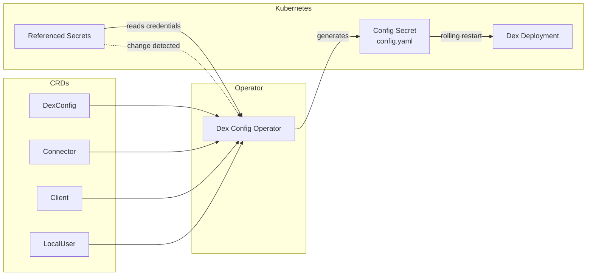

# Architecture

## Overview

The Dex Config Operator (DCO) manages Dex identity provider configuration through Kubernetes Custom Resource Definitions (CRDs). Instead of manually editing a `config.yaml` file, users declare their desired state through CRDs, and the operator produces a working Dex configuration automatically.



1. Users create and update **DexConfig**, **Connector**, **Client**, and **LocalUser** CRDs.
1. The operator collects all CRDs, reads any referenced Kubernetes Secrets for credentials, and generates a complete Dex `config.yaml`.
1. The generated configuration is stored in a **Kubernetes Secret**.
1. The operator triggers a **rolling restart** of the Dex Deployment so it picks up the new configuration.
1. When a referenced Secret changes (for example, during credential rotation), the operator detects the change and regenerates the configuration automatically.

## How Configuration Is Generated

When any CRD or referenced Secret changes, the operator runs the following steps:

1. **Collect resources** -- gather all Connector, Client, and LocalUser resources across the cluster, filtering out any with `enabled: false`.
1. **Resolve secrets** -- for each resource that references a Secret, read the Secret and extract the required values.
1. **Generate configuration** -- combine the DexConfig settings with all collected connectors, clients, and local users into a complete Dex `config.yaml`.
1. **Update the config Secret** -- write the generated YAML into a Kubernetes Secret. If the Secret already exists, update it in place.
1. **Restart Dex** -- trigger a rolling restart of the Dex Deployment so the new configuration takes effect with zero downtime.

## How Dex Is Restarted

When the generated configuration changes, the operator updates an annotation on the Dex Deployment's pod template. Kubernetes detects this change and performs a rolling restart of all pods, ensuring zero-downtime configuration updates.

This is the same mechanism used by `kubectl rollout restart`.

## When Does the Operator Act

| Trigger | Timing | Description |
|---|---|---|
| Resource change | Immediate | Any create, update, or delete of a CRD or referenced Secret triggers configuration regeneration. |
| Periodic sync | Every 10 minutes | A full sync runs periodically to catch any drift or missed events. |
| Error retry | After 1 minute | When an error occurs, the operator retries automatically. |

## Secret Watching

Many CRDs reference Kubernetes Secrets for sensitive data such as client secrets, connector credentials, or user password hashes. The operator needs to detect when those Secrets change so it can regenerate the configuration.

To do this, the operator labels every referenced Secret with:

```yaml
dex-config-operator.stakater.com/watch: "true"
```

Only Secrets carrying this label are monitored. When a labeled Secret is created, updated, or deleted, the operator regenerates the full configuration and restarts Dex if the output has changed.
