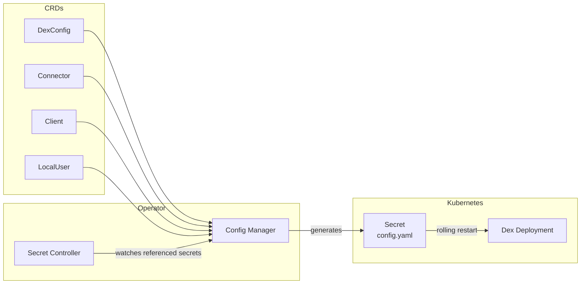

# Architecture

## Overview

The Dex Config Operator (DCO) manages Dex identity provider configuration through Kubernetes Custom Resource Definitions (CRDs). Instead of manually editing a `config.yaml` file, users declare their desired state through CRDs, and the operator reconciles that state into a working Dex configuration.



1. Users create and update **DexConfig**, **Connector**, **Client**, and **LocalUser** CRDs.
1. The **Config Manager** collects all CRDs, resolves referenced Secrets, and generates a complete `config.yaml`.
1. The generated configuration is written to a **Kubernetes Secret**.
1. The operator triggers a **rolling restart** of the Dex Deployment so it picks up the new configuration.
1. The **Secret Controller** watches any Secret that is referenced by a CRD. When a referenced Secret changes, it triggers re-reconciliation so the configuration stays in sync.

## Abstraction Layer

The operator is designed around an interface-based abstraction that decouples CRD reconciliation from the specifics of Dex. This makes it possible to swap Dex for another OIDC provider without rewriting the controllers.

```text
Controllers (reconcile CRDs)
    │
    ▼
internal/config/Manager
    │
    ▼
pkg/config/types/ConfigManager  (interface)
    │
    ▼
internal/config/dex/Manager     (Dex-specific implementation)
    │
    ▼
Kubernetes Secret               (serialized config.yaml)
```

- **Controllers** handle the Kubernetes reconciliation loop for each CRD type. They call into the Config Manager when a resource changes.
- **`internal/config/Manager`** orchestrates the collection of all CRDs and delegates to the provider-specific manager through the `ConfigManager` interface.
- **`pkg/config/types/ConfigManager`** defines the contract that any OIDC provider implementation must satisfy.
- **`internal/config/dex/Manager`** implements that contract for Dex. It knows how to translate the operator's internal types into a valid Dex `config.yaml`.

## Controllers

The operator runs one controller per CRD type, plus a Secret controller:

| Controller | Watches | Responsibility |
|---|---|---|
| DexConfig | `DexConfig` resources | Reconciles the singleton cluster-wide Dex configuration (issuer, storage, web settings, etc.) |
| Connector | `Connector` resources | Reconciles OIDC, LDAP, SAML, and other identity provider connectors |
| Client | `Client` resources | Reconciles OAuth2 client registrations (redirect URIs, scopes, secrets) |
| LocalUser | `LocalUser` resources | Reconciles static user/password entries for the local connector |
| Secret | `Secret` resources | Watches Secrets labeled for the operator and triggers re-reconciliation when they change |

## Config Generation Pipeline

When any CRD or watched Secret changes, the operator runs the following pipeline:

1. **Collect CRDs** -- List all Connector, Client, and LocalUser resources across the cluster. Filter out any resource with `enabled: false`.
1. **Fetch Secrets** -- For each CRD that references a Secret (via `SecretReference` or `SecretKeyReference`), retrieve the Secret and extract the required key.
1. **Build DexConfig struct** -- Assemble the full Dex configuration in memory, merging the singleton DexConfig with all collected connectors, clients, and local users.
1. **Serialize to YAML** -- Marshal the DexConfig struct into a valid `config.yaml`.
1. **Create or update Secret** -- Write the serialized YAML into a Kubernetes Secret. If the Secret already exists, update it in place.
1. **Trigger rolling restart** -- Patch the Dex Deployment to initiate a rolling restart so the new configuration takes effect.

## Deployment Restart Strategy

The operator restarts the Dex Deployment by patching the pod template with a timestamp annotation:

```text
dex-config-operator.stakater.com/restartedAt: "<current-timestamp>"
```

Updating this annotation causes Kubernetes to perform a rolling restart of all pods in the Deployment. This is the same mechanism used by `kubectl rollout restart` and ensures zero-downtime configuration updates.

## Reconciliation Timing

The operator uses three reconciliation triggers:

| Trigger | Interval | Description |
|---|---|---|
| Immediate | On change | Any create, update, or delete of a watched CRD or labeled Secret triggers reconciliation immediately. |
| Periodic | 10 minutes | A full reconciliation runs every 10 minutes to catch any drift or missed events. |
| Error retry | 1 minute | When a reconciliation fails, the controller retries after 1 minute. |

## Secret Controller and Labeling

Many CRDs reference Kubernetes Secrets to store sensitive values such as client secrets, LDAP bind passwords, or static user password hashes. The operator needs to know when those Secrets change so it can regenerate the configuration.

To accomplish this, the operator labels every referenced Secret with:

```yaml
dex-config-operator.stakater.com/watch: "true"
```

The Secret controller sets up a watch filtered to Secrets carrying this label. When a labeled Secret is created, updated, or deleted, the Secret controller triggers re-reconciliation of the relevant CRDs, which in turn regenerates the full configuration and restarts Dex if needed.
