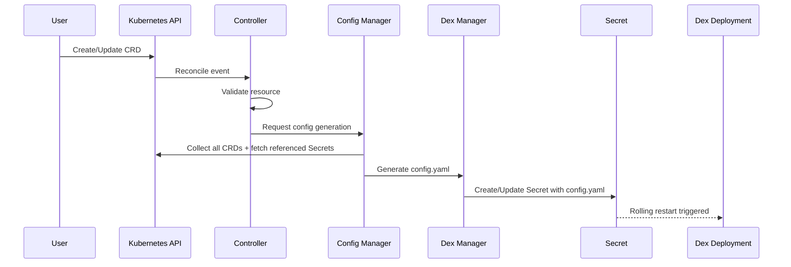

# Core Concepts

## Configuration Flow

The Dex Config Operator follows a declarative workflow. Users express their desired state through CRDs, and the operator converges the running Dex instance to match.



1. The user creates or updates a CRD (DexConfig, Connector, Client, or LocalUser).
2. The responsible controller receives the reconcile event and validates the resource.
3. The Config Manager collects every CRD across the cluster and fetches any referenced Secrets.
4. The Dex Manager generates a complete `config.yaml` from the collected state.
5. The generated configuration is written into a Kubernetes Secret.
6. The Dex Deployment is restarted to pick up the new configuration.

## Secret References

CRDs that need sensitive data do not embed it inline. Instead, they reference a Kubernetes Secret using one of two structures:

**SecretReference** -- points to a specific key within a specific Secret:

```yaml
secretRef:
  name: my-oidc-secret
  namespace: dex
  key: client-secret
```

**SecretKeyReference** -- a shorthand when the namespace can be inferred:

```yaml
secretKeyRef:
  name: my-oidc-secret
  key: client-secret
```

When the operator resolves a Secret reference for the first time, it labels the Secret so the Secret controller can watch it:

```yaml
labels:
  dex-config-operator.stakater.com/watch: "true"
```

If the referenced Secret is later updated (for example, during a credential rotation), the Secret controller detects the change and triggers a re-reconciliation. This ensures the Dex configuration always reflects the latest secret values without manual intervention.

## Status Conditions

Every CRD managed by the operator reports its health through a set of standard status conditions. Each condition has a `type`, a `status` (`True`, `False`, or `Unknown`), and a human-readable `message`.

| Condition | Meaning |
|---|---|
| **Ready** | The resource has been fully reconciled and is contributing to the active Dex configuration. |
| **SecretResolved** | All Secret references in the resource have been successfully resolved. A `False` value indicates a missing or inaccessible Secret. |
| **ConfigurationValid** | The resource passed validation and can be serialized into a valid Dex configuration block. |
| **Synced** | The generated configuration has been written to the Secret and the Dex Deployment has been restarted. |

A resource is considered healthy when all four conditions are `True`.

## Phases

Each CRD carries a `phase` field in its status that provides a quick summary of the resource lifecycle:

| Phase | Description |
|---|---|
| **Pending** | The resource has been created but has not yet been fully reconciled. This is the initial state and also the state during active reconciliation. |
| **Ready** | Reconciliation succeeded. The resource is valid, all Secrets are resolved, and the configuration has been synced to Dex. |
| **Failed** | Reconciliation encountered an error. Inspect the status conditions and controller logs for details. The operator will retry after 1 minute. |

```
Pending ──► Ready
   │
   └──► Failed
```

## Enable and Disable

Every CRD includes an `enabled` field that defaults to `true`. Setting it to `false` excludes the resource from the generated Dex configuration without deleting it from the cluster.

```yaml
apiVersion: dco.stakater.com/v1alpha1
kind: Connector
metadata:
  name: github
spec:
  enabled: false
  # ... remaining spec
```

This is useful when you need to temporarily remove a connector or client from Dex (for example, during maintenance or debugging) but want to preserve the full resource definition for later re-enablement.

When a resource is disabled:

- It is excluded from the next config generation cycle.
- Its status phase remains **Ready** (the resource itself is valid; it is simply not active).
- Re-enabling it triggers an immediate reconciliation that adds it back to the Dex configuration.

## Singleton DexConfig

The **DexConfig** CRD is a singleton -- only one instance is permitted per cluster. It defines the global Dex settings such as the issuer URL, storage backend, and web server configuration.

If a second DexConfig resource is created, the operator rejects it and sets the resource phase to **Failed** with a descriptive error message.

The singleton constraint exists because Dex itself operates with a single configuration file. Allowing multiple DexConfig resources would create ambiguity about which settings should take effect.
