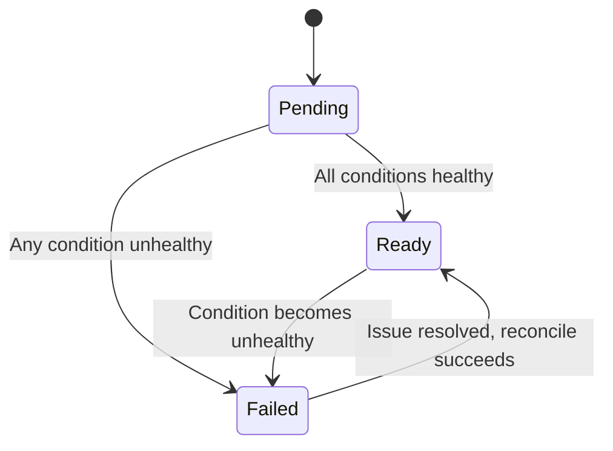

# Troubleshooting

This guide helps you diagnose and resolve common issues with the Dex Config Operator.

## Understanding Status Conditions

Every DCO custom resource reports its state through a set of status conditions. Inspect them with:

```bash
kubectl get <resource-type> <name> -o jsonpath='{.status.conditions}' | jq .
```

### Condition Types

| Condition | Meaning | Healthy Value |
|---|---|---|
| `Ready` | The resource has been fully reconciled and is part of the active Dex configuration. | `True` |
| `SecretResolved` | All referenced Secrets have been found and their contents read successfully. | `True` |
| `ConfigurationValid` | The generated Dex configuration passes structural validation. | `True` |
| `Synced` | The generated config Secret has been written and the Dex Deployment has been restarted. | `True` |

### Common Reason Values

| Condition | Reason | Description |
|---|---|---|
| `SecretResolved` | `SecretNotFound` | A referenced Secret does not exist. |
| `SecretResolved` | `SecretKeyMissing` | The Secret exists but the referenced key is not present. |
| `SecretResolved` | `SecretResolved` | All Secrets resolved successfully. |
| `ConfigurationValid` | `ValidationFailed` | The assembled configuration did not pass validation. |
| `ConfigurationValid` | `Valid` | Configuration is structurally correct. |
| `Synced` | `SyncFailed` | The operator could not write the config Secret or restart Dex. |
| `Synced` | `Synced` | Config Secret written and Dex restarted. |
| `Ready` | `Ready` | Resource is fully reconciled. |
| `Ready` | `Failed` | One or more upstream conditions are not healthy. |

## Phase Lifecycle

Each resource progresses through phases that reflect its reconciliation state.



- **Pending** -- The resource has been created but has not completed its first reconciliation.
- **Ready** -- All conditions are `True`. The resource is part of the active Dex configuration.
- **Failed** -- One or more conditions are not healthy. Check the conditions for details.

## Troubleshooting Scenarios

### Resource Stuck in Pending

A resource that remains in `Pending` usually means the operator has not processed it yet.

```bash
# Check the operator pod is running
kubectl get pods -n dex-config-operator-system

# View operator logs for reconciliation errors
kubectl logs -n dex-config-operator-system deployment/dex-config-operator-controller-manager

# Check conditions on the resource
kubectl describe connector <name> -n <namespace>
```

### Resource in Failed State

Inspect the status conditions to identify which condition failed.

```bash
# Get full status block
kubectl get connector <name> -n <namespace> -o yaml | grep -A 30 "status:"

# Check for SecretResolved failures
kubectl get connector <name> -n <namespace> \
  -o jsonpath='{.status.conditions[?(@.type=="SecretResolved")]}'
```

**Common causes:**

- The referenced Secret does not exist. Create it or fix the `secretRef`.
- The Secret exists but is missing the expected key. Verify the key name.
- The operator does not have RBAC permission to read the Secret's namespace.

### Configuration Not Updating

If you update a CRD but the Dex configuration does not change:

```bash
# Confirm the resource shows Ready
kubectl get connector <name> -n <namespace>

# Check the Synced condition
kubectl get connector <name> -n <namespace> \
  -o jsonpath='{.status.conditions[?(@.type=="Synced")]}'

# Inspect the generated config Secret
kubectl get secret dex-config -n dex -o jsonpath='{.data.config\.yaml}' | base64 -d
```

### Dex Not Restarting After Config Change

The operator restarts Dex by patching the Deployment (default) or deleting it. If Dex does not restart:

```bash
# Check the SECRET_CHANGE_ACTION setting
kubectl get deployment dex-config-operator-controller-manager -n dex-config-operator-system \
  -o jsonpath='{.spec.template.spec.containers[0].env}' | jq .

# Verify the Dex Deployment exists and matches the configured name
kubectl get deployment dex -n dex

# Look for restart annotations on the Dex pods
kubectl get deployment dex -n dex \
  -o jsonpath='{.spec.template.metadata.annotations}'
```

### Secret Changes Not Detected

The operator only watches Secrets that carry the watch label. If updating a Secret does not trigger reconciliation:

```bash
# Check whether the Secret has the watch label
kubectl get secret <secret-name> -n <namespace> --show-labels

# Add the label if missing
kubectl label secret <secret-name> -n <namespace> \
  dex-config-operator.stakater.com/watch="true"
```

After adding the label, the operator will detect future changes to the Secret and trigger reconciliation automatically.

### Multiple DexConfig Error

Only one DexConfig resource is allowed per cluster. If you see an error about multiple DexConfig resources:

```bash
# List all DexConfig resources across namespaces
kubectl get dexconfig -A

# Delete the extra resource
kubectl delete dexconfig <name> -n <namespace>
```

The operator reconciles only the first DexConfig it discovers. Additional DexConfig resources are rejected with a status condition indicating the conflict.

### Enable Debug Logging

Increase the operator's log verbosity to get more detail during troubleshooting.

```bash
# Edit the controller manager deployment to add the -zap-log-level flag
kubectl set env deployment/dex-config-operator-controller-manager \
  -n dex-config-operator-system \
  ZAP_LOG_LEVEL=debug

# Or patch the deployment args directly
kubectl patch deployment dex-config-operator-controller-manager \
  -n dex-config-operator-system \
  --type='json' \
  -p='[{"op": "add", "path": "/spec/template/spec/containers/0/args/-", "value": "--zap-log-level=debug"}]'
```

Then tail the logs:

```bash
kubectl logs -f -n dex-config-operator-system \
  deployment/dex-config-operator-controller-manager
```

### Viewing the Generated Configuration

To inspect the full Dex configuration that the operator produces:

```bash
# Decode the config Secret
kubectl get secret dex-config -n dex \
  -o jsonpath='{.data.config\.yaml}' | base64 -d

# Compare with what Dex is actually using (if mounted as a file)
kubectl exec -n dex deployment/dex -- cat /etc/dex/config.yaml
```

!!! tip
    Pipe the decoded config through `yq` or `python -m yaml` for readable formatting:
    ```bash
    kubectl get secret dex-config -n dex \
      -o jsonpath='{.data.config\.yaml}' | base64 -d | yq .
    ```
